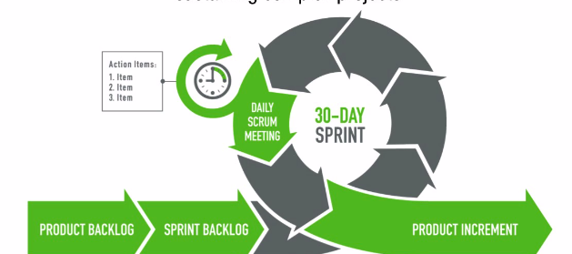
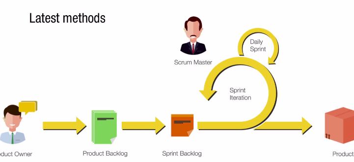
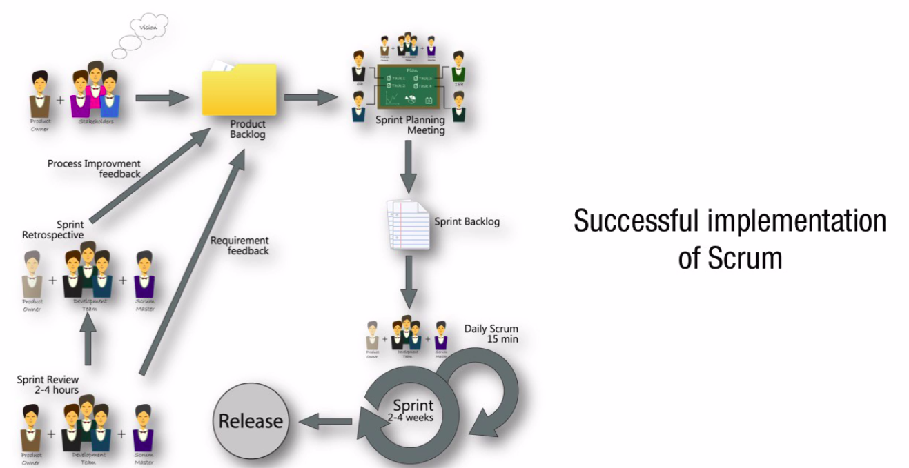
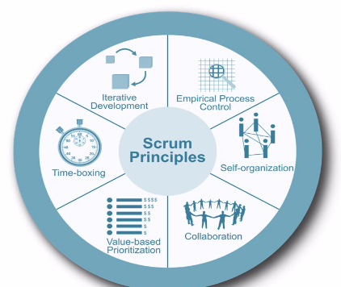
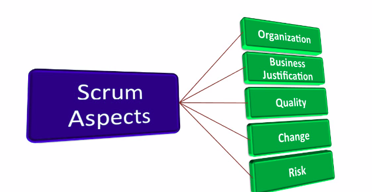
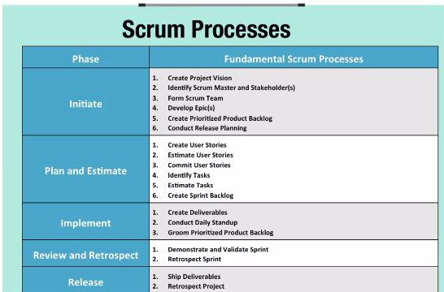

<h1>Chapter 1 - Introduction do Scrum</h1>

<h2>Introduction to Scrum</h2>

* Scrum is a framework for developing and sustaining complex projects.

* What is the Scrum body of knowledge?
    * It is a compilation of delivery method and best practices employed by its practitioners and experts.
    * It provides guidelines for successfull implementation of Scrum.
    * Most popular agile project management and project development framework.

* Provides comprehensive framework that includes
    * Principles
    * Aspects
    * Processes

* The Scrum framework is widely used across
    * Portfolios
    * Programs
    * Projects in any industry
    * Products
    * Services
    * Any other deliverables to be developed
    * Projects of any size or complexity

* Product - Therm
    * Service that are deliverable.

* Practicality of Scrum as a framework
    * Can be applied effectively to any project in any industry.

* Small projects with 6-person teams or large complex projects with up to several hundred team members.

<h2>Overview of Scrum</h2>